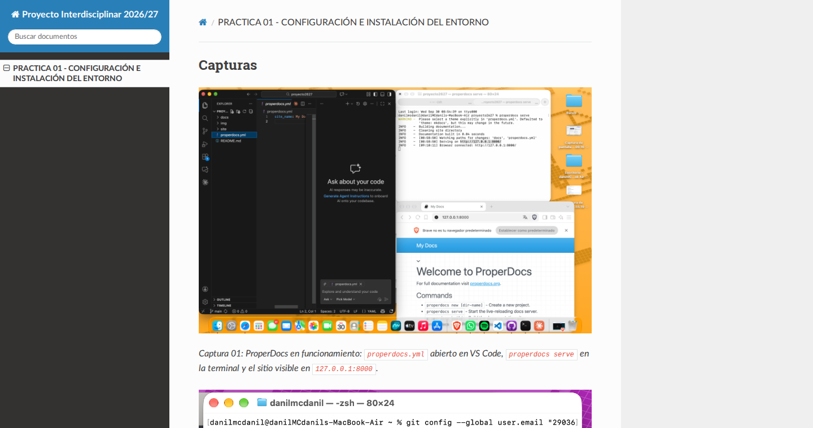
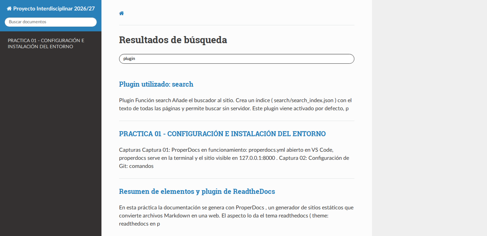

## Capturas


*Captura 01: ProperDocs en funcionamiento: `properdocs.yml` abierto en VS Code, `properdocs serve` en la terminal y el sitio visible en `127.0.0.1:8000`.*


*Captura 02: Configuración de Git: comandos `git config` y listado con el usuario y el email.*


*Captura 03: Comprobación de la sesión de GitHub con `gh auth status`.*


*Captura 04: Comprobación de la instalación de Herd con `herd --version` (1.30.1).*


*Captura 05: Carpeta personal en Finder con `Herd`, `docs`, `proyecto2627` y `properdocs.yml`.*


*Captura 06: Herd, sección Sites: sitio `misitio.test` con PHP 8.4 y ruta `~/Herd/misitio/`.*

## Resumen de elementos y plugin de ReadtheDocs

En esta práctica la documentación se genera con **ProperDocs**, un generador de sitios estáticos que convierte archivos Markdown en una web. El aspecto lo da el tema **`readthedocs`** (`theme: readthedocs` en `properdocs.yml`), que ofrece una barra lateral de navegación, un buscador integrado y un diseño que se adapta al tamaño de la pantalla. Con `locale: es` los textos del tema (buscador, botones anterior/siguiente) aparecen en español.



*Captura 07: Sitio generado con el tema `readthedocs`: barra lateral con el menú definido en `nav`, cuadro de búsqueda arriba a la izquierda, ruta de navegación y contenido a la derecha.*

### Elementos utilizados

| Elemento | Dónde se configura | Qué hace |
|---|---|---|
| `site_name` | `properdocs.yml` | Título del sitio, que se muestra en la cabecera de la barra lateral |
| `nav` | `properdocs.yml` | Define el menú lateral y el orden de las páginas |
| `theme` (`readthedocs`, `locale: es`) | `properdocs.yml` | Tema con barra lateral y buscador, con la interfaz en español |
| `markdown_extensions` (`pymdownx.*`) | `properdocs.yml` | Amplían el Markdown: bloques de código (`superfences`, `highlight`), avisos (`blocks.admonition`), listas de tareas (`tasklist`), teclas (`keys`), texto marcado (`mark`), etc. |
| `extra_javascript` | `properdocs.yml` | Carga MathJax (fórmulas matemáticas) y `js/copy-button.js`, un script propio para copiar el código |
| `extra_css` | `properdocs.yml` | Añade una hoja de estilos propia guardada en `docs/css/` |
| Carpeta `docs/` | Proyecto | Páginas en Markdown y recursos: `img/` (capturas), `css/` y `js/` |
| Carpeta `site/` | Se genera sola | HTML estático resultante de ejecutar `properdocs build` |

### Plugin utilizado: `search`

| Plugin | Función |
|---|---|
| `search` | Añade el buscador al sitio. Crea un índice (`search/search_index.json`) con el texto de todas las páginas y permite buscar sin servidor. |

Este plugin viene activado por defecto, por eso no aparece escrito en `properdocs.yml`. Si se quisiera declarar de forma explícita bastaría con añadir:

```yaml
plugins:
  - search
```



*Captura 08: El plugin `search` en funcionamiento: al escribir en el cuadro de búsqueda aparecen las páginas y secciones que contienen el texto.*
